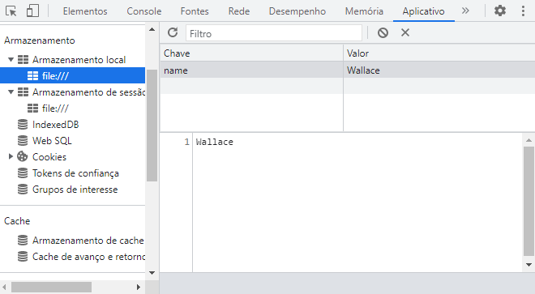

# JavaScript - localStorage

* Recurso para `salvar dados no navegador`, que persiste após o recarregamento da página ou a o fechar a aba;

* Capacidade máxima de `10mb`;

* Os dadps `não possuem tempo de exnpiração`, mas pode ser removidos;

* Os dados ficam na `aba Application` do Dev tools.

    

