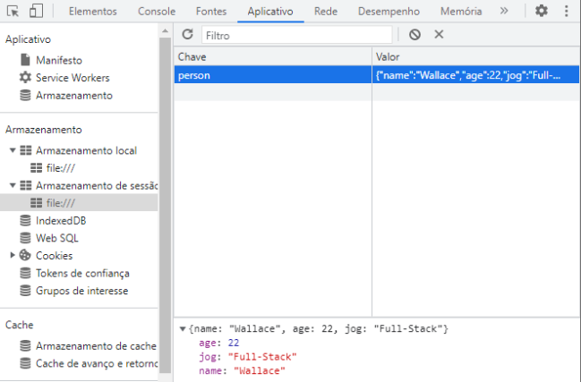

# JavaScript - sessionStorage

* Recurso `similar ao localStorage`;

* Capacidade máxima de `5mb`;

* Os dados são salvos no `computador do usuário`;

* Os dados expiram `quando a aba é fechada`.

    

