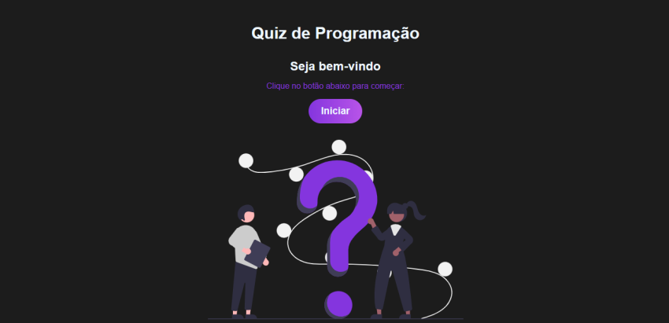

# PROJECT: REACT Quiz



<hr>

<div align="center">
    <h2>PROCEDIMENTO DE CRIAÇÃO</h2>
    <p>
        <i>(React - Vipe)</i>
    </p>
</div>

```py
Ativação do React (com com VIPE):
	|
	`--> npm create vite@latest 
		`--> npm install
			`--> npm run dev
```

<div align="center">
    <h2>TECNOLOGIAS UTILIZADAS</h2>
</div>

<div align="center">
    <table>
        <tr align="center">
            <td columnspan="2">Front-END Structure</td>
            <td columnspan="1">Language</td>
            <td columnspan="1">Library</td>
            <td columnspan="1">Extension Language</td>
        </tr>
        <tr align="center">
            <td>
                
                
            </td>
            <td>
                
            </td>
            <td>
                
            </td>
            <td>
                
            </td>
        </tr>
    </table>
</div>